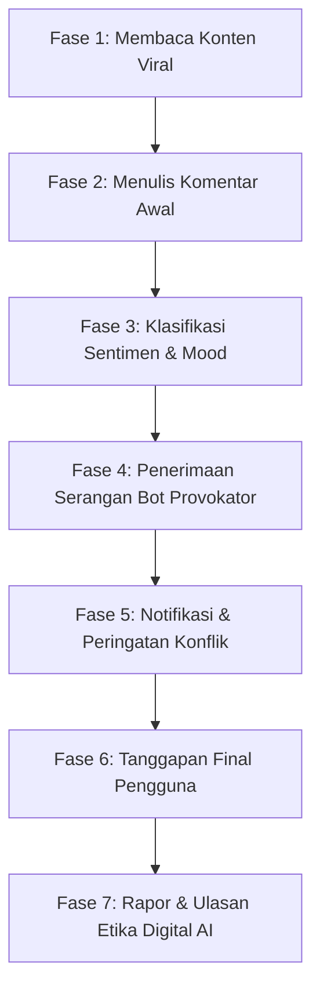

# 🦅 War Comment Lab: Simulator Etika Digital Berbasis Pancasila

[](https://nextjs.org/)
[](https://react.dev/)
[](https://tailwindcss.com/)
[](https://deepmind.google/technologies/gemini/)
[](https://www.typescriptlang.org/)

**War Comment Lab** adalah aplikasi simulator interaktif berbasis web yang dirancang untuk menguji, melatih, dan mengevaluasi etika digital netizen Indonesia di tengah situasi konflik media sosial. Aplikasi ini menggunakan **Gemini 2.5 Flash API** dengan arsitektur **Hybrid Fallback** untuk mengklasifikasi komentar dan mengevaluasi tanggapan pengguna berdasarkan nilai-nilai **Sila ke-2 (Kemanusiaan yang Adil dan Beradab)** dan **Sila ke-3 (Persatuan Indonesia)** Pancasila.

Aplikasi ini sangat cocok sebagai bagian dari portofolio untuk menunjukkan integrasi AI modern (*Generative AI Agent*), arsitektur frontend modular, UI premium, serta kepedulian terhadap isu sosial digital (*digital citizenship*).

---

## 🎯 Mengapa Proyek Ini Menarik? (Branding Portofolio)

1. **Integrasi Hybrid AI yang Resilien**: Menggabungkan kemampuan analisis kognitif dari *Large Language Model* (Gemini 2.5 Flash) dengan algoritma lokal (*heuristic keyword-based*) untuk menjamin fungsionalitas aplikasi tetap berjalan lancar walaupun API sedang offline atau tanpa kunci API.
2. **Arsitektur Next.js & React 19 Modern**: Dibangun menggunakan Next.js App Router terbaru, React Server/Client Components, state management berbasis session lokal, dan optimasi performa tinggi.
3. **UI/UX Premium & Estetis**: Mengadopsi prinsip desain modern dengan visualisasi progres simulasi bertahap, layout panel ganda (*split-screen layout*), animasi mikro, indikator ring chart interaktif, serta skema warna yang elegan.
4. **Kasus Penggunaan Dunia Nyata**: Mengangkat masalah polarisasi dan toxic netizen di Indonesia, serta mengaitkannya dengan hukum digital nasional (**UU ITE**) dan pilar kebangsaan (**Pancasila**).

---

## 🚀 Fitur Utama

- 🎭 **Sosial Media Feed Sandbox**: Simulasi postingan viral yang memancing reaksi emosional dari warganet.
- 🤖 **Bot Provocateur Simulator**: Komentar awal pengguna akan dianalisis secara real-time untuk memicu serangan balasan dari bot provokator yang disesuaikan secara dinamis (*positive, negative, neutral, sarcastic*).
- 🧬 **Interactive 7-Phase State Engine**: Alur simulasi terbagi menjadi 7 fase terstruktur, memandu warganet dari proses paparan konflik hingga evaluasi etika.
- 🦅 **Rapor Etika Pancasila**: Skor numerik dari 0–100 untuk Sila ke-2 dan Sila ke-3, lengkap dengan ulasan kualitatif dari AI dan prediksi kelulusan (*Pancasialis* vs *Toxic Netizen*).
- 🚨 **UU ITE Compliance Warning**: Peringatan preventif hukum jika pengguna terdeteksi melontarkan komentar kebencian yang melanggar hukum riil (UU ITE Pasal 28 Ayat 2).
- 💾 **Local History Storage**: Riwayat simulasi tersimpan secara otomatis menggunakan LocalStorage sehingga pengguna dapat meninjau rapor simulasi sebelumnya secara instan.

---

## 🛠️ Alur Simulasi (7-Phase Workflow)



1. **Fase 1 (Melihat Konten)**: Pengguna disuguhi konten media sosial viral yang kontroversial.
2. **Fase 2 (Komentar Awal)**: Pengguna mengetikkan reaksi spontan mereka.
3. **Fase 3 (Klasifikasi)**: AI mengidentifikasi kategori komentar (Positif, Negatif, Sarkas, atau Netral).
4. **Fase 4 (Serangan Bot)**: Bot provokator meluncurkan serangan balasan sesuai dengan sentimen awal pengguna.
5. **Fase 5 (Notifikasi)**: Menampilkan alert simulasi serangan warganet lain untuk memicu tekanan psikologis.
6. **Fase 6 (Balasan Final)**: Pengguna diuji untuk merespons bot secara bijak di bawah tekanan emosi.
7. **Fase 7 (Hasil Rapor)**: AI menganalisis adab dan persatuan dalam komentar penutup pengguna.

---

## 📊 Matriks Penilaian Etika Digital

| Kriteria Uji | Fokus Penilaian | Indikator Skor Rendah (Toxic) | Indikator Skor Tinggi (Pancasialis) |
| :--- | :--- | :--- | :--- |
| **Sila ke-2** <br>*(Kemanusiaan)* | Adab, empati, anti-kekerasan, pilihan diksi, dan toleransi. | Caci maki, *doxxing*, ancaman kekerasan fisik, penggunaan kata kasar. | Solutif, mendorong klarifikasi hukum resmi, empati pada korban. |
| **Sila ke-3** <br>*(Persatuan)* | Mencegah konflik horizontal, de-eskalasi, dan menolak polarisasi. | Provokasi kelompok, ajakan *sweeping*, memanas-manasi massa. | Meredam pertikaian, mengajak damai, bersikap objektif dan tenang. |

---

## 📁 Struktur Proyek Utama

```text
chatbot/
├── public/                 # Aset gambar & ilustrasi (confrontation.png, dll)
└── src/
    ├── app/
    │   ├── api/
    │   │   └── simulate/
    │   │       └── route.ts # API Route Handler (Klasifikasi & Evaluasi Gemini AI)
    │   ├── globals.css     # Gaya CSS & Kustomisasi Tailwind v4
    │   ├── layout.tsx      # Entry point layout Next.js
    │   └── page.tsx        # Halaman utama aplikasi (Home Screen)
    ├── components/
    │   ├── auth/
    │   │   └── LoginScreen.tsx # Screen login simulasi nama/avatar
    │   ├── layout/
    │   │   ├── AppShell.tsx     # Layout frame utama aplikasi
    │   │   ├── LeftSidebar.tsx  # Sidebar navigasi skenario & riwayat lokal
    │   │   └── RightPanel.tsx   # Panel progres & kriteria evaluasi
    │   ├── simulation/
    │   │   ├── AttackNotification.tsx # Banner pop-up interaktif simulasi
    │   │   ├── BotReplyCard.tsx       # Tampilan komentar balasan bot
    │   │   ├── ClassifyingLoader.tsx  # Animasi loading klasifikasi AI
    │   │   ├── CommentInput.tsx       # Form input komentar chat
    │   │   ├── FakeComments.tsx       # Tampilan mock komentar warganet lain
    │   │   ├── PhaseInstructor.tsx    # Informasi instruksi setiap fase
    │   │   ├── ScenarioFeed.tsx       # Tampilan feed media sosial utama
    │   │   ├── ScoreReport.tsx        # Tampilan Rapor & Chart penilaian
    │   │   └── SimulationOrchestrator.tsx # Pengendali utama state simulasi
    │   └── ui/              # Shadcn UI reusable components (button, card, dll)
    └── lib/
        └── utils.ts         # Utility Helper Tailwind CSS merge
```

---

## 🛠️ Teknologi yang Digunakan

* **Framework**: [Next.js 16 (App Router)](https://nextjs.org/)
* **Library UI**: [React 19](https://react.dev/) & [Radix UI primitives](https://www.radix-ui.com/)
* **CSS Engine**: [Tailwind CSS v4](https://tailwindcss.com/)
* **Icons**: [Lucide React](https://lucide.dev/)
* **AI Model API**: [Google Gemini 2.5 Flash API](https://deepmind.google/technologies/gemini/)

---

## ⚙️ Persiapan & Instalasi

### 1. Prasyarat
Pastikan Anda sudah menginstal:
* [Node.js](https://nodejs.org/) (versi 18.x atau yang lebih baru)
* npm atau yarn / pnpm

### 2. Kloning Repositori
```bash
git clone https://github.com/Kazetama/chatbot.git
cd chatbot
```

### 3. Konfigurasi Variabel Lingkungan (.env)
Salin file `.env.example` menjadi `.env` di direktori utama proyek:
```bash
cp .env.example .env
```
Buka file `.env` dan masukkan API Key Gemini Anda:
```env
GEMINI_API_KEY=isi_dengan_api_key_gemini_anda
```
> 💡 *Catatan: Jika API Key tidak diisi atau salah, aplikasi akan secara otomatis mendeteksi hal tersebut dan mengaktifkan **Local Fallback Mode** menggunakan pencocokan kata kunci lokal agar fungsionalitas tetap berjalan prima.*

### 4. Instal Dependensi
```bash
npm install
```

### 5. Jalankan Server Pengembangan
```bash
npm run dev
```
Buka [http://localhost:3000](http://localhost:3000) di browser Anda untuk melihat aplikasi berjalan secara langsung.

---

## 💡 Cara Menambahkan Skenario Baru

Anda dapat memperluas simulasi ini dengan mudah dengan menambahkan skenario kasus baru pada array `SCENARIOS` di dalam file `src/components/simulation/SimulationOrchestrator.tsx`:

```typescript
export const SCENARIOS: ScenarioDef[] = [
  // Skenario yang sudah ada ...
  {
    id: "skenario-baru",
    shortTitle: "Judul Singkat",
    title: "Judul Lengkap Skenario",
    platform: "Instagram", // "Twitter/X" | "Facebook" | "Instagram" | "TikTok"
    posterName: "Nama Akun Viral",
    posterHandle: "@akun_viral",
    posterAvatar: "AV",
    postCaption: "Isi takarir/caption postingan provokatif di sini...",
    postImage: "/path-to-image.png", // Masukkan gambar di folder public/
    postTime: "10 menit yang lalu",
    likes: "25.3K",
    shares: "12K",
    comments: "5.4K",
    difficulty: "Sedang", // "Mudah" | "Sedang" | "Sulit"
  }
];
```

---

## 👨‍💻 Kontributor & Pengembang

* **Kazetama** - *Full Stack Engineer & Creator*
* **Email**: tamaketuahimpunan@gmail.com
* **GitHub**: [github.com/Kazetama](https://github.com/Kazetama)

---

## 📄 Lisensi
Proyek ini dilisensikan di bawah [MIT License](LICENSE). Anda bebas menggunakannya untuk kebutuhan edukasi dan portofolio profesional Anda.
